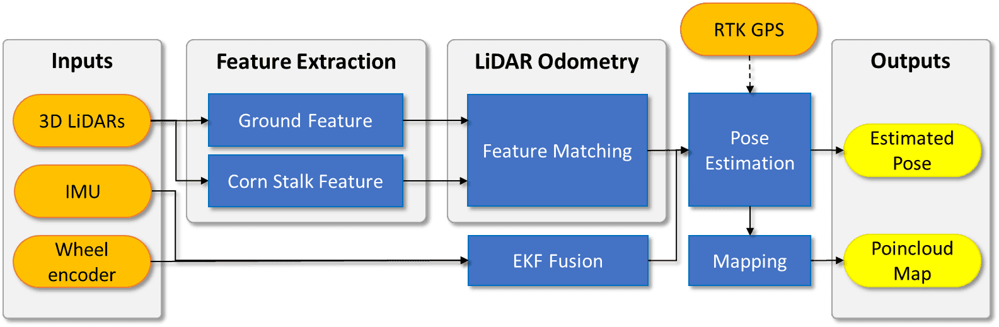

# P-AgSLAM: In-Row and Under-Canopy SLAM for Agricultural Monitoring in Cornfields

Purdue AgSLAM or P-AgSLAM is an in-row and under-canopy Simultaneous Localization and Mapping (SLAM) framework which is designed for robot pose estimation and agricultural monitoring in cornfields. Our SLAM approach is primarily based on a 3D light detection and ranging (LiDAR) sensor and it is designed for the extraction of unique morphological features of cornfields which have significantly different characteristics from structured indoor and outdoor urban environments. The performance of the proposed approach has been validated with experiments in simulation and in real cornfield environments. P-AgSLAM outperforms existing state-of-the-art LiDAR-based state estimators in robot pose estimations and mapping.

    

