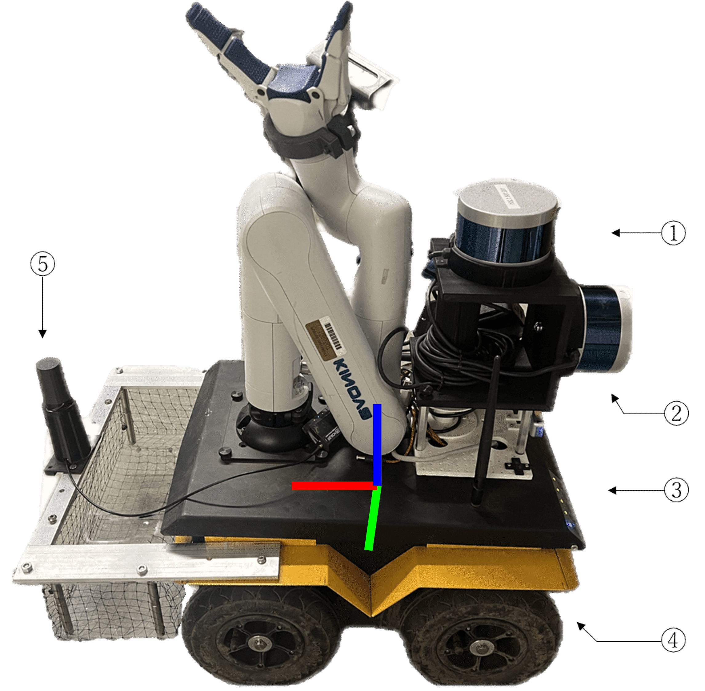
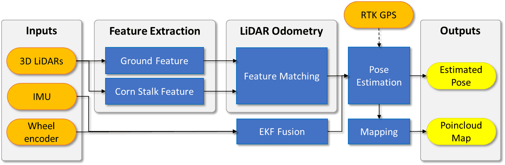

# P-AgSLAM: In-Row and Under-Canopy SLAM for Agricultural Monitoring in Cornfields

Purdue AgSLAM or P-AgSLAM is an in-row and under-canopy Simultaneous Localization and Mapping (SLAM) framework which is designed for robot pose estimation and agricultural monitoring in cornfields. Our SLAM approach is primarily based on a 3D light detection and ranging (LiDAR) sensor and it is designed for the extraction of unique morphological features of cornfields which have significantly different characteristics from structured indoor and outdoor urban environments. The performance of the proposed approach has been validated with experiments in simulation and in real cornfield environments. P-AgSLAM outperforms existing state-of-the-art LiDAR-based state estimators in robot pose estimations and mapping.


## System Overview

#### Robot platform: Purdue AgBot (P-AgBot)

P-AgBot is a customized platform with a variety of sensors and a robotic arm. Its physical size is 40 cm in width and 60 cm in length, including the front leaf storage bin. In this research, five sensors are used for P-AgSLAM: 1. Horizontal 3D LiDAR, 2. Vertical 3D LiDAR, 3. Internal IMU, 4. UGV wheel encoders, and 5. RTK GPS module. Each axis of the robot frame, represented by the colors red, green, and blue, corresponds to the X, Y, and Z translational and rotational axes, respectively.

<p align='center'>
    
</p>

#### Framework
There are two primary modules in P-AgSLAM. (1) LiDAR-based feature extractor and (2) a robot state estimator using a factor graph with optional GPS measurements. The two modules collaboratively minimize drift and publish accurate robot poses and maps. For more information about the P-AgSLAM framework, please read [our published paper](https://doi.org/10.1109/LRA.2024.3386466).

<p>
    
</p>

## Dependency

- [ROS](http://wiki.ros.org/ROS/Installation) (Tested with noetic.)
- [gtsam](https://gtsam.org/get_started/) (Georgia Tech Smoothing and Mapping library)


```
sudo add-apt-repository ppa:borglab/gtsam-release-4.0
sudo apt install libgtsam-dev libgtsam-unstable-dev
```

## Install & Run the package

#### Package Installation
Use the following commands to download and compile the package.

```
cd ~/catkin_ws/src

# (1) Git clone the LiDAR-based feature extractor.
git clone https://github.com/kimkt0408/pagslam.git 

# (2) Git clone a robot state estimator using a factor graph with optional GPS measurements.
git clone https://github.com/kimkt0408/gtsam_test.git

cd ..
catkin_make
```

#### Run P-AgSLAM

```
roslaunch gtsam_test factorGraph.launch
```


#### ROS Topic Inputs

| Topic                  | Description                                          | ROS Message Type            |
|------------------------|------------------------------------------------------|-----------------------------|
| `/cmd_vel`             | Robot linear and angular velocity                        | `geometry_msgs/Twist`       |
| `/gps/fix`             | RTK GPS measurements                                 | `sensor_msgs/NavSatFix`     |
| `/imu/data`            | Robot IMU data                                       | `sensor_msgs/Imu`           |
| `/ns1/velodyne_points` | Point cloud from horizontal LiDAR `velodyne1`        | `sensor_msgs/PointCloud2`   |
| `/ns2/velodyne_points` | Point cloud from vertical LiDAR `velodyne2`          | `sensor_msgs/PointCloud2`   |
| `/odometry/filtered`   | Filtered odometry from wheel encoders and IMU fusion | `nav_msgs/Odometry`         |
| `/tf`                  | Sensor coordinate frames relationship                | `tf2_msgs/TFMessage`        |

Feel free to use [our cornfield dataset](https://github.com/kimkt0408/ACRE-Dataset.git), collected at the Purdue Agronomy Center for Research and Education (ACRE).

#### ROS Topic Outputs

| Topic                  | Description                                          | ROS Message Type            |
|------------------------|------------------------------------------------------|-----------------------------|
| `/gtsam/optimized_pose_`             | Robot pose result from P-AgSLAM                       | `geometry_msgs::PoseStamped`       |
| `/gtsam/trajectory_`             | Robot trajectory from P-AgSLAM                                  | `visualization_msgs::MarkerArray`     |
| `/gtsam/mapCloud_`            | 3D point cloud map from P-AgSLAM                                      | `visualization_msgs::MarkerArray`           |


## Citation

If you use this code for your research, please consider citing our works:

```
@ARTICLE{10494876,
  author={Kim, Kitae and Deb, Aarya and Cappelleri, David J.},
  journal={IEEE Robotics and Automation Letters}, 
  title={P-AgSLAM: In-Row and Under-Canopy SLAM for Agricultural Monitoring in Cornfields}, 
  year={2024},
  volume={9},
  number={6},
  pages={4982-4989},
  keywords={Feature extraction;Laser radar;Robots;Simultaneous localization and mapping;Three-dimensional displays;Point cloud compression;Monitoring;Agricultural automation;robotics and automation in agriculture and forestry;SLAM},
  doi={10.1109/LRA.2024.3386466}}
```
